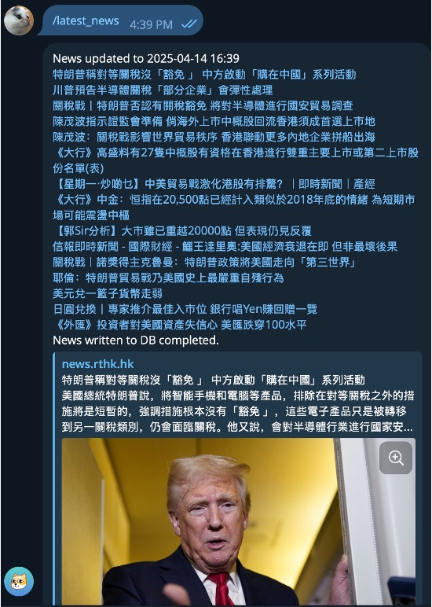
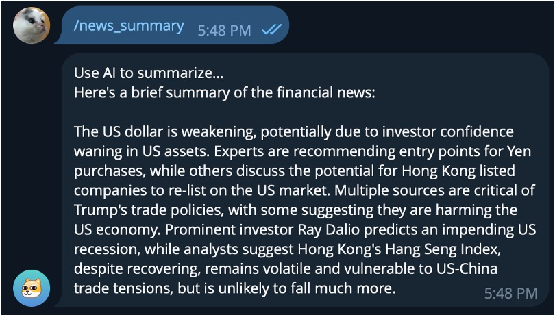
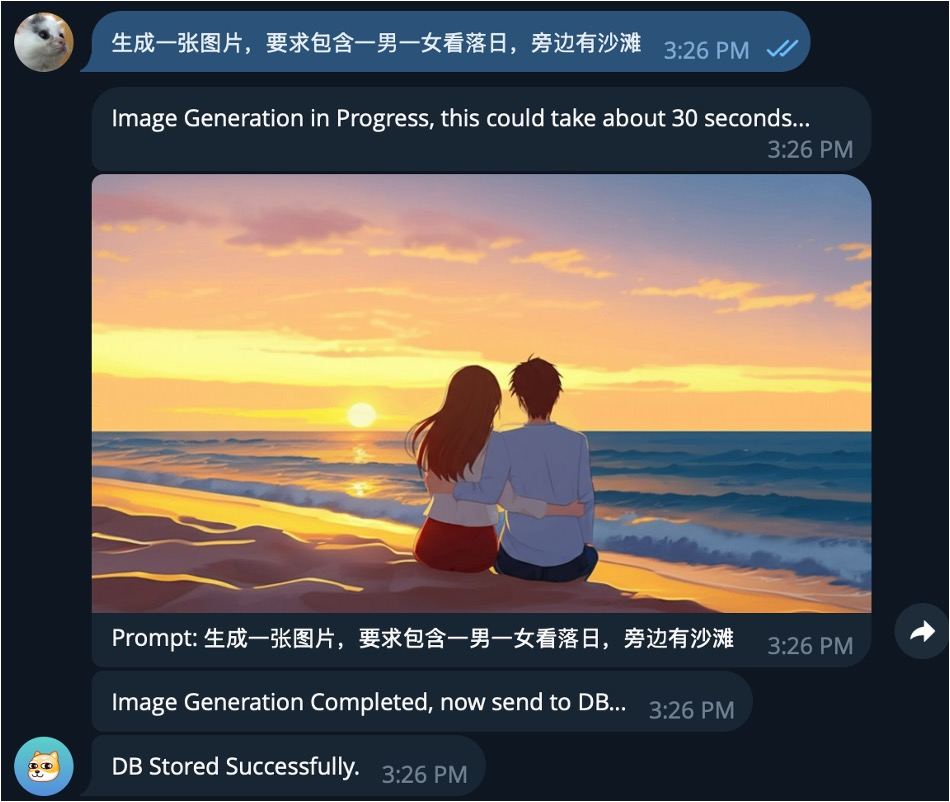
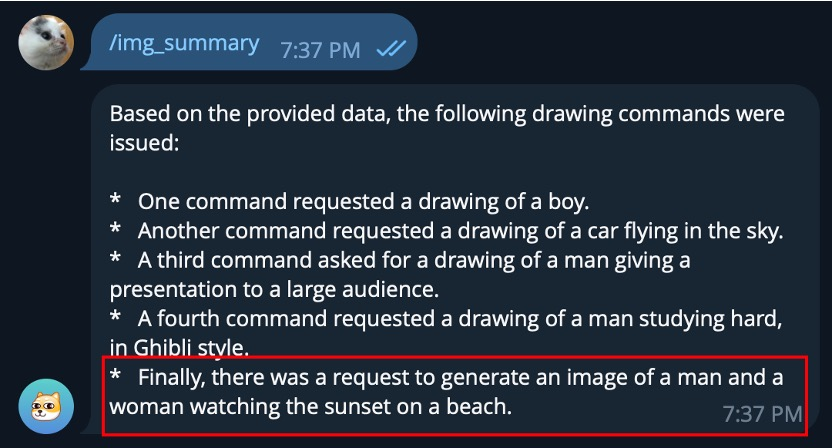
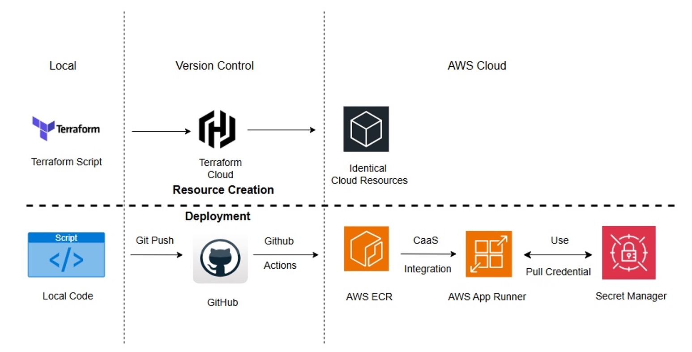
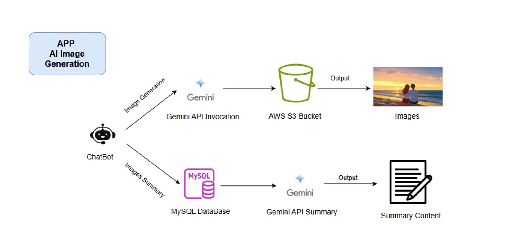
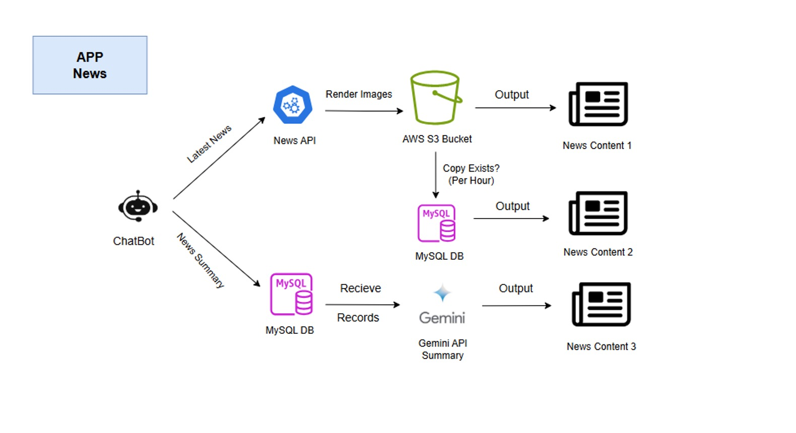

# TGBot for Cloud Computing COMP7940
Telegram Bot for Cloud Computing COMP7940 course project. It involves 2 main features: News Aggregation and AI Image Generation.
## Features
- **News Aggregation**: 
  - Retrieve local Financial news 
  - Use Gemini API to summarize all news.
<br/>


- **AI Image Generation**:
  - Generate image with Gemini image API
  - Use Gemini API to summarize all generated images
<br/>


## Installation
1. Install dependencies
```bash
pip install -r requirements.txt
```
2. Apply Gemini API key and Google News API key
Google News: https://serpapi.com/google-news-api
Gemini API: https://developers.google.com/gemini/docs/getting-started
3. Prepare for cloud resources
- **DB**: AWS Mysql Server
- **AWS S3 Bucket**: Store all generated images
- **ECR**: AWS ECR for Docker image
- **AWS AppRunner**: CaaS service
4. Set up environment variables
```bash
export ACCESS_TOKEN_TG=
export HOST=
export PASSWORD=
export REDISPORT=
export DB_NAME=
export DECODE_RESPONSES=True
export USER_NAME=
export BASICURL=
export MODELNAME=
export APIVERSION=
export ACCESS_TOKEN_LLM=
export GEMINI_API_KEY=
export GEMINI_MODEL=gemini-2.0-flash
export MAX_TOKEN=
export IMG_WORDS="image,photo,图片,draw,picture"
export PROMPT="You're given a list of data stored the database, with the format: export (timestamp, command, filename). Please summarize the command part into export sentences based on provided data:\n"
export KEY_NEWS=
```
4. Run the bot with local
```bash
python3 chatbot.py
```
5. [Simplified] Use Terraform Script to deploy identical cloud resources
```bash
cd .terraform
terraform init
terraform apply
```
6. Deploy with GitHub Actions

## Architecture
- **Version Control**: Resource Creation and Deployment

- **AI Image Generation**

- **News Aggregation**
